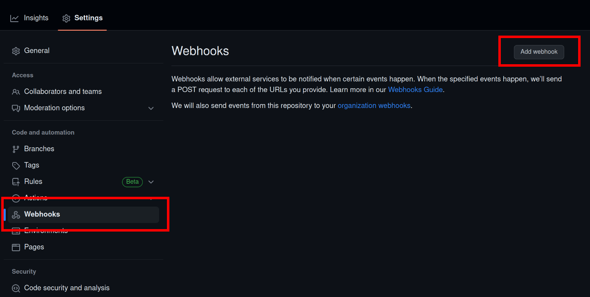
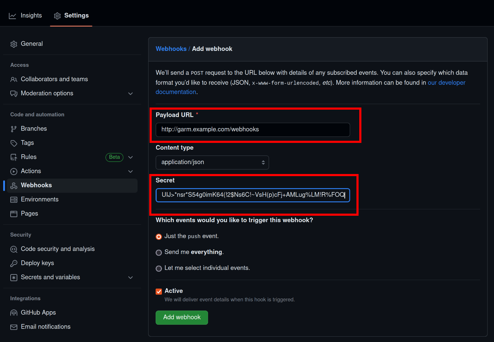
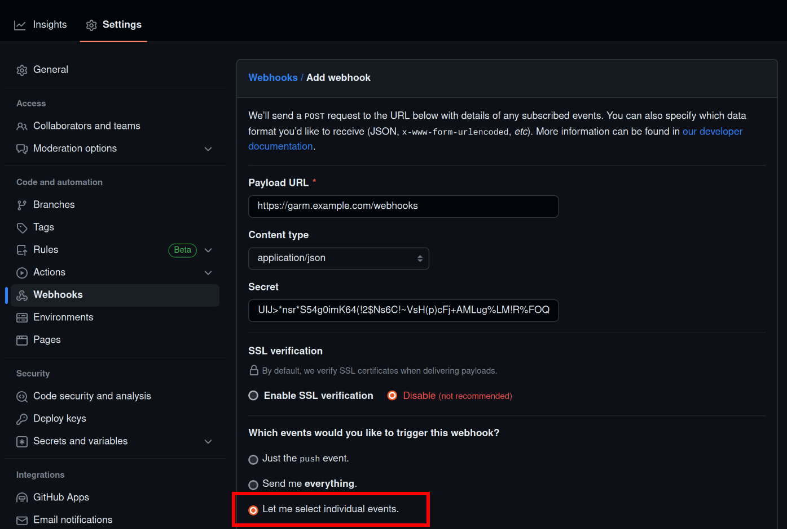
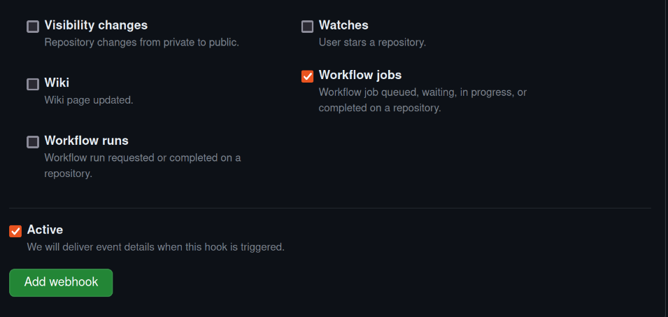

# Webhooks

Garm is designed to auto-scale github runners. To achieve this, ```garm``` relies on [GitHub Webhooks](https://docs.github.com/en/developers/webhooks-and-events/webhooks/about-webhooks). Webhooks allow ```garm``` to react to workflow events from your repository, organization or enterprise.

In your repository or organization, navigate to ```Settings --> Webhooks```:



And click on ```Add webhook```.

In the ```Payload URL``` field, enter the URL to the ```garm``` webhook endpoint. The ```garm``` API endpoint for webhooks is:

  ```txt
  POST /webhooks
  ```

If ```garm``` is running on a server under the domain ```garm.example.com```, then that field should be set to ```https://garm.example.com/webhooks```.

In the webhook configuration page under ```Content type``` you will need to select ```application/json```, set the proper webhook URL and, really important, **make sure you configure a webhook secret**. Garm will authenticate the payloads to make sure they are coming from GitHub.

The webhook secret must be secure. Use something like this to generate one:

  ```bash
  gabriel@rossak:~$ function generate_secret () {
      tr -dc 'a-zA-Z0-9!@#$%^&*()_+?><~\`;' < /dev/urandom | head -c 64;
      echo ''
  }

  gabriel@rossak:~$ generate_secret
  9Q<fVm5dtRhUIJ>*nsr*S54g0imK64(!2$Ns6C!~VsH(p)cFj+AMLug%LM!R%FOQ
  ```

Make a note of that secret, as you'll need it later when you define the repo/org/enterprise in ```GARM```.



While you can use `http` for your webhook, I highly recommend you set up a proper x509 certificate for your GARM server and use `https` instead. If you choose `https`, GitHub will present you with an aditional option to configure the SSL certificate verification. 


If you're testing, you can disable SSL verification or just use `http`, but for production you should use `https` with a proper certificate and SSL verification set to `enabled`.

It's fairly trivial to set up a proper x509 certificate for your GARM server. You can use [Let's Encrypt](https://letsencrypt.org/) to get a free certificate.


Next, you can choose which events GitHub should send to ```garm``` via webhooks. Click on ```Let me select individual events```.



Now select ```Workflow jobs``` (should be at the bottom). You can send everything if you want, but any events ```garm``` doesn't care about will simply be ignored.



Finally, click on ```Add webhook``` and you're done.

GitHub will send a test webhook to your endpoint. If all is well, you should see a green checkmark next to your webhook. 